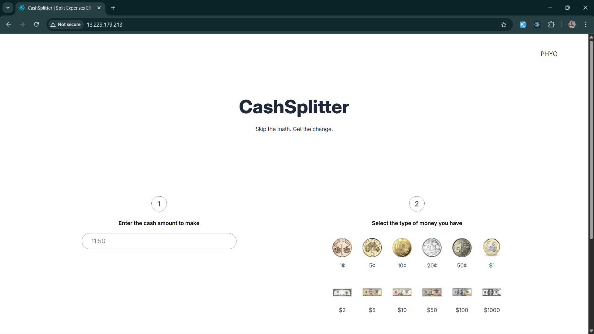

## 🧮 Coin Challenge Frontend (CashSplitter)

[](https://react.dev/)
[](https://vitejs.dev/)
[](https://tailwindcss.com/)
[](https://www.docker.com/)
[](LICENSE)

A sleek and interactive **React** web app that communicates with the backend to calculate the minimum number of coins or notes needed for a given amount. Built with **Vite**, styled with **TailwindCSS**, and containerized using **Docker** for easy deployment.


### 🚀 Features

* 💸 User-friendly interface to input target amounts and allowed denominations
* 🔁 Real-time API integration with a Java Dropwizard backend
* 📦 Docker-ready for seamless deployment
* 🌐 Hosted frontend connects to a backend via configurable API URL

---

### 📸 Preview

 

---

### 🛠️ Tech Stack

* **React** (Vite)
* **TypeScript**
* **TailwindCSS**
* **Axios**
* **Docker**
* Hosted on: AWS EC2 (via Docker)

---

### 📦 Setup & Development

#### 1. Clone the Repo

```bash
git clone https://github.com/your-username/coin-challenge-frontend.git
cd coin-challenge-frontend
```

#### 2. Install Dependencies

```bash
npm install
```

#### 3. Set the API URL

Create a `.env` file and specify the backend URL:

```env
VITE_API_URL=http://<your-backend-ip>:8080/api
```

#### 4. Run in Development

```bash
npm run dev
```

Frontend will be available at: `http://localhost:5173`

---

### 🐳 Docker Build & Run

#### Build the Docker Image

```bash
docker build --build-arg VITE_API_URL=http://<your-backend-ip>:8080/api -t coin-challenge-frontend .
```

#### Run the Container

```bash
docker run -p 80:80 coin-challenge-frontend
```

App will be accessible at: `http://localhost`

---

### 🔐 Notes

* Make sure CORS is enabled in your backend if accessing across domains/IPs.
* When deploying, update `VITE_API_URL` to match your backend’s **public endpoint**.

---

### 📄 License

MIT License
## 🧮 Coin Challenge Frontend (CashSplitter)

[](https://react.dev/)
[](https://vitejs.dev/)
[](https://tailwindcss.com/)
[](https://www.docker.com/)
[](LICENSE)

A sleek and interactive **React** web app that communicates with the backend to calculate the minimum number of coins or notes needed for a given amount. Built with **Vite**, styled with **TailwindCSS**, and containerized using **Docker** for easy deployment.


### 🚀 Features

* 💸 User-friendly interface to input target amounts and allowed denominations
* 🔁 Real-time API integration with a Java Dropwizard backend
* 📦 Docker-ready for seamless deployment
* 🌐 Hosted frontend connects to a backend via configurable API URL

---

### 📸 Preview

 <!-- Add a screenshot if available -->

---

### 🛠️ Tech Stack

* **React** (Vite)
* **TypeScript**
* **TailwindCSS**
* **Axios**
* **Docker**
* Hosted on: AWS EC2 (via Docker)

---

### 📦 Setup & Development

#### 1. Clone the Repo

```bash
git clone https://github.com/your-username/coin-challenge-frontend.git
cd coin-challenge-frontend
```

#### 2. Install Dependencies

```bash
npm install
```

#### 3. Set the API URL

Create a `.env` file and specify the backend URL:

```env
VITE_API_URL=http://<your-backend-ip>:8080/api
```

#### 4. Run in Development

```bash
npm run dev
```

Frontend will be available at: `http://localhost:5173`

---

### 🐳 Docker Build & Run

#### Build the Docker Image

```bash
docker build --build-arg VITE_API_URL=http://<your-backend-ip>:8080/api -t coin-challenge-frontend .
```

#### Run the Container

```bash
docker run -p 80:80 coin-challenge-frontend
```

App will be accessible at: `http://localhost`

---

### 🔐 Notes

* Make sure CORS is enabled in your backend if accessing across domains/IPs.
* When deploying, update `VITE_API_URL` to match your backend’s **public endpoint**.

---

### 📄 License

MIT License
